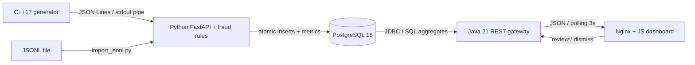

# OpenTrace Analytics

**FraudWatch Engine** — локальный учебный проект для потокового обнаружения подозрительных транзакций: C++ → Python → PostgreSQL → Java → JavaScript.

Генератор создаёт синтетические платежи, движок проверяет четыре объяснимых правила, а дашборд показывает реальные записи из базы и позволяет расследовать алерты. Данные обновляются каждые 3 секунды. Никакие внешние финансовые сервисы и API-ключи не нужны.

## Быстрый запуск

Требования: Docker Desktop с работающим Linux engine на Windows/macOS или Docker Engine + Compose v2 на Linux. На Windows для Docker Desktop нужен WSL 2. Официальная [инструкция установки Docker](https://docs.docker.com/desktop/setup/install/windows-install/).

Клонируй репозиторий, затем запусти сервисы:

```sh
git clone https://github.com/dinrkz/fraud_analytics_engine.git
cd fraud_analytics_engine
docker compose up --build -d
docker compose ps
```

Первая сборка скачает базовые образы и зависимости; последующие используют кэш. Дашборд запускается после успешных healthcheck аналитики и Java API.

Если Docker только что установлен и команда ещё не появилась в PATH, перезапусти терминал/IDE. Для установки Docker Desktop на текущего пользователя в Windows доступен и полный путь:

```powershell
& "$env:LOCALAPPDATA\Programs\DockerDesktop\resources\bin\docker.exe" compose ps
```

| Адрес | Назначение |
| --- | --- |
| [localhost:8088](http://localhost:8088) | Дашборд |
| [localhost:8088/engine/docs](http://localhost:8088/engine/docs) | Swagger UI для Python ingestion API |
| [localhost:8088/api/health](http://localhost:8088/api/health) | Состояние цепочки |
| `localhost:55432` | PostgreSQL для подключения из IDE |

По умолчанию БД, пользователь и пароль: `opentrace`, `opentrace`, `opentrace_local`. Все опубликованные порты привязаны к `127.0.0.1`. Это локальный sandbox с синтетическими данными и без авторизации пользователей; его не следует публиковать в интернет как есть.

Настройки необязательны: скопируй `.env.example` в `.env`, измени нужные значения и повтори запуск. Например, если PostgreSQL уже занимает порт `55432`, укажи другой `DB_PORT`. Контейнеры общаются по внутреннему порту `5432` независимо от этого значения.

```sh
docker compose logs -f analytics
docker compose stop
docker compose start
docker compose down
```

`stop` и `down` сохраняют именованный том PostgreSQL. Не добавляй `-v`, если хочешь сохранить данные. SQL из `db/init` применяется автоматически только к пустому тому. Изменение пароля в `.env` не меняет пароль в уже инициализированной базе.

## Что есть в интерфейсе

- **Overview:** оборот, число транзакций, доля подозрительных операций, активные отправители, временной график, страны, последние сигналы и здоровье сервисов.
- **Transactions:** поиск по event ID, отправителю, магазину или стране; фильтр риска; постраничный просмотр.
- **Fraud alerts:** поиск, фильтр статуса, карточка с причиной, действия Review / Dismiss / Reopen. Статус сохраняется в PostgreSQL.
- **Detection rules:** действующие правила и их пороги.
- Общие действия: диапазон 15 минут / час / 6 часов / сутки, пауза обновления, ручное обновление и CSV-экспорт с учётом диапазона и фильтров.

Все суммы в первой версии — USD. Время хранится в UTC, интерфейс показывает локальную временную зону браузера. Для диапазонов 6/24 часа график использует укрупнённые интервалы. KPI считает **транзакции** с признаками риска; один платёж может создать несколько **алертов**.

## Архитектура



В Compose четыре сервиса: `db`, `analytics`, `api`, `dashboard`. C++ компилируется в отдельной стадии Docker-сборки и запускается как дочерний процесс Python внутри `analytics`. Pipe даёт простую обратную связь по скорости чтения: если база замедляется, ограниченная очередь заполняется и генератор ждёт. Отдельный брокер для этого четырёхдневного MVP не требуется.

Python отвечает за валидацию, правила, запись и статистику пользователей. Java — за чтение агрегатов и изменение статусов расследования. Для Java выбран JDK HttpServer + JDBC вместо Spring: один внешний JAR, явные SQL-запросы и небольшой контейнер. Фронтенд — HTML/CSS/JavaScript и SVG-график без npm-сборки и внешних CDN. Swagger UI по умолчанию загружает свои ресурсы через CDN.

## Данные и правила

Рабочая схема находится в [`db/init/001_schema.sql`](db/init/001_schema.sql). Исходный PostgreSQL-дамп [`db/sql/v1_schema.sql`](db/sql/v1_schema.sql) сохранён как исторический артефакт; Compose его не импортирует. Рабочая схема предназначена для отдельной пустой базы, а не для автоматической миграции старого дампа.

| Таблица | Роль |
| --- | --- |
| `users` | Измерение: синтетические отправители и получатели |
| `transactions` | Факт: UUID события, участники, сумма, страна, event time, риск |
| `rules` | Порог, окно и описание каждого правила |
| `fraud_alerts` | Причина срабатывания и статус расследования |
| `user_metrics` | Число событий, сумма, среднее и M2 по алгоритму Welford |
| `engine_state` | Heartbeat, счётчик принятых/отклонённых событий и состояние генератора |

Деньги хранятся как `NUMERIC(15,2)`, IP — `inet`, время — `timestamptz`. Индексы покрывают время, пару отправитель/время, подозрительные события и выборку алертов по статусу. Уникальные ограничения защищают `event_id` и пару транзакция/правило. Конкретные индексы нужно проверять через `EXPLAIN ANALYZE` на целевой нагрузке.

| Правило | Условие | Риск |
| --- | --- | --- |
| `HIGH_AMOUNT` | Сумма ≥ $5,000 | 85 |
| `AMOUNT_SPIKE` | После 20 предыдущих наблюдений сумма > max($100, mean + 3 × sample stddev) | 75 |
| `VELOCITY` | Не менее 6 операций отправителя за последние 60 секунд, включая текущую | 80 |
| `COUNTRY_HOP` | Страна отличается от предыдущей операции в пределах 300 секунд | 90 |

Риск транзакции — максимальный риск сработавших правил, не вероятность мошенничества. Проверка смены страны — простой сигнал, а не доказательство физически невозможного перемещения: VPN, поездки и маршрутизация могут давать ложные срабатывания.

Проверка суммы выполняется **до** включения текущей суммы в baseline. Для обычного потока среднее и дисперсия обновляются алгоритмом Welford. Позднее событие получает исторический baseline из БД: будущие относительно него события в расчёт не попадают. Временные окна используют `created_at`, а не время поступления.

## Контракт события

Формат — один JSON-объект на строку, кодировка UTF-8. Обязательные поля:

| Поле | Формат |
| --- | --- |
| `event_id` | UUID, идентификатор для дедупликации |
| `sender_id`, `receiver_id` | Разные целые ID, 1…1,000,000 |
| `amount` | Положительная десятичная сумма, максимум 2 знака после точки; генератор передаёт строкой |
| `currency` | `USD` |
| `country` | Двухбуквенный код в верхнем регистре |
| `merchant` | Непустая строка до 100 символов |
| `sender_ip` | IPv4 или IPv6 |
| `device_id` | Непустая строка до 64 символов |
| `transaction_type` | `purchase` или `transfer` |
| `created_at` | ISO 8601 с обязательной временной зоной |

Неизвестные поля, отрицательная сумма, одинаковые участники и время без зоны отклоняются. Endpoint `/engine/ingest` принимает массив от 1 до 500 таких объектов. Ответ: `accepted`, `duplicates`, `alerts`.

Событие, его алерты и изменение метрик фиксируются одной транзакцией БД. Повтор той же UUID не меняет метрики. При временной ошибке БД Python сохраняет текущий пакет в памяти и повторяет запись. API-клиент может безопасно повторить запрос с теми же UUID.

## Генератор и импорт файлов

Автоматически запускается поток 20 событий/секунду для 1000 пользователей. Суммы обычных платежей распределены логнормально; аномальные сценарии включают большие суммы, быстрые смены страны и серии операций одного отправителя.

Изменение `.env`:

```dotenv
GENERATOR_RATE=100
GENERATOR_USERS=1000
FRAUD_RATE=0.08
```

`FRAUD_RATE` задаёт вероятность выбора сценария, а не точную долю флагов на дашборде: один сценарий может выпускать несколько событий, правила могут пересекаться.

Генерация конечного файла в контейнере без ограничения скорости:

```sh
docker compose exec analytics transaction_generator --rate 0 --count 100000 --seed 42 --output /tmp/transactions.jsonl
docker compose cp analytics:/tmp/transactions.jsonl ./transactions.jsonl
python scripts/import_jsonl.py transactions.jsonl --url http://localhost:8088/engine/ingest
```

Повторный импорт того же файла покажет дубликаты. Для воспроизводимых тестов задай также `--start-time` и `--run-id`; подробности в [`data_generator/README.md`](data_generator/README.md). Детерминированный режим задаёт логическое event time, которое при большой скорости может уходить вперёд. UI показывает события до текущего времени; для живого демо используй обычный режим.

## REST API

```sh
curl "http://localhost:8088/api/stats?minutes=60"
curl "http://localhost:8088/api/transactions?limit=25&offset=0&risk=flagged&minutes=60"
curl "http://localhost:8088/api/fraud-alerts?status=new&limit=25&minutes=60"
curl "http://localhost:8088/api/rules"
curl "http://localhost:8088/api/health"
```

Изменение статуса существующего алерта (замени `123` реальным ID):

```sh
curl -X PATCH http://localhost:8088/api/fraud-alerts/123 -H "Content-Type: application/json" -d '{"status":"reviewed"}'
```

В Windows PowerShell удобнее:

```powershell
Invoke-RestMethod http://localhost:8088/api/fraud-alerts/123 -Method Patch -ContentType application/json -Body '{"status":"reviewed"}'
```

Для списков доступны `search`, `limit` (1…200), `offset`, `minutes`. Поиск параметризован; `%` и `_` считаются обычным текстом. Временной диапазон относится к event time транзакции, в том числе для алертов. Статистика и списки читаются из согласованного снимка БД внутри каждого запроса. Между разными запросами поток продолжает изменяться.

## Проверки

```sh
python -m unittest discover -s tests -p "test_*.py" -v
python tests/smoke.py --base-url http://localhost:8088
```

`smoke.py` добавляет 30 синтетических событий в работающую базу: проверяет все четыре правила, повторный импорт, обработку позднего события без подмешивания будущей локации, валидацию, поиск, агрегаты и изменение статуса алерта. Данные остаются для просмотра в UI. Тесты чистых правил не требуют PostgreSQL.

Проверка генератора после локальной CMake-сборки описана в его README. Команды Java-проверок валидаторов приведены в [`backend_api/README.md`](backend_api/README.md#boundary-tests); `backend_api/build.ps1` собирает основной код. Для наблюдения за реальным потоком сравни `processedEvents` в `/api/health` с интервалом несколько секунд: число должно расти, `generatorRunning` — быть `true`.

Результаты проверок и их ограничения записаны в [`docs/VERIFICATION.md`](docs/VERIFICATION.md).

## Локальная разработка без Docker

Нужны C++17 toolchain, Python 3.11+, JDK 21+ и PostgreSQL 18. Скрипты [`scripts/start-local.ps1`](scripts/start-local.ps1) и [`scripts/stop-local.ps1`](scripts/stop-local.ps1) предназначены для Windows. Они используют отдельную БД в `.local/pgdata` и не меняют существующий сервер PostgreSQL. Локальный URL — `http://localhost:8080`.

```powershell
.\scripts\start-local.ps1
.\scripts\stop-local.ps1
```

Не запускай локальную БД и Compose с одним и тем же опубликованным портом `55432` одновременно.

Если Windows Application Control блокирует самостоятельно скомпилированный `.exe`, используй Docker. Не нужно отключать защиту Windows. Установки системных компонентов локальный launcher не выполняет; Python-зависимости и скачанный JDBC находятся внутри проекта.

## Ограничения и следующий этап

- Это рабочий потоковый MVP на одной машине, а не распределённая Big Data платформа. Генерация гигабайтов и скорость полной цепочки — разные измерения; заявления о производительности требуют отдельного бенчмарка.
- Один сериализованный writer обеспечивает понятную семантику и целостность. При масштабировании нужны очередь/брокер, partitioning по sender ID, батчи/COPY и продуманное хранение state.
- Очередь и текущий пакет находятся в RAM. При падении процесса возможна потеря ещё не записанных синтетических событий. Дедупликация в БД не означает end-to-end exactly-once.
- Поздние события оцениваются относительно уже доступной истории. Ранее обработанные события задним числом не пересчитываются. Watermark, allowed lateness и пересчёт окон — следующий этап.
- Baseline суммы накопительный; нет сезонности, decay, обучения на подтверждённых исходах и мультивалютной нормализации.
- Данные и алерты автоматически не удаляются. Для длительных запусков нужны retention и партиционирование.
- CSV использует пагинацию по меняющемуся потоку, поэтому это удобный экспорт для анализа, а не транзакционно согласованный бухгалтерский отчёт.
- Перед публичным развёртыванием нужны аутентификация, роли, TLS, отдельные права БД и управление секретами.

## Структура и учебный план

```text
data_generator/         C++ CLI, CMake, black-box self-check
analytics_engine/       FastAPI, validation, rules, worker, storage
db/init/                Runtime SQL initialization
db/sql/v1_schema.sql    Original PostgreSQL dump
backend_api/            Java HTTP gateway and JDBC queries
frontend_dashboard/    HTML/CSS/JS, nginx
scripts/                Local startup and JSONL import
tests/                  Rule tests and API smoke test
compose.yaml            Four local services
```


Репозиторий: [dinrkz/fraud_analytics_engine](https://github.com/dinrkz/fraud_analytics_engine). Локальный исходный код не требует подключения GitHub для запуска после скачивания зависимостей и сборки образов.
